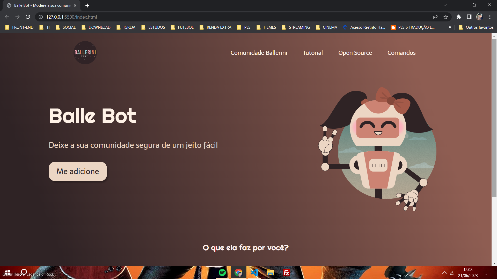

# Landing Page - Balle Bot

<https://lucasdecarvalho-dev.github.io/landing-page_Balle-Bot/>

Landing Page da Balle Bot inspirado pela Rafa Ballerini <a href="https://github.com/rafaballerini/LandingPage">link do repositório</a>. 

- HTML5 e CSS3
- Aplicação de conceitos 
  - HTML:
    - Semântica: ((`<header>`), (`<main>`), (`<footer>`))
  - CSS:
    - Flexbox (`display: flex`)
    - Transições (`transition-duration: 0.4s;`)
    - Pseudo-classe (`:hover`)
  
(obs: projeto atualizado frequentemente)